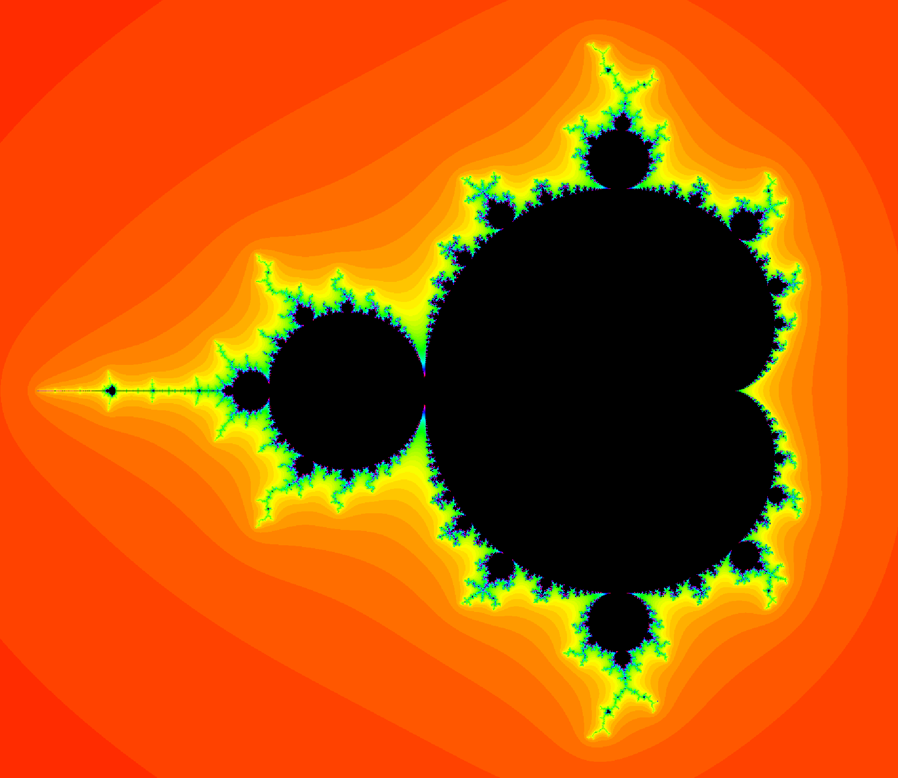

# Mandelbrot Set Renderer

# The program

The fractal is rendered by performing the iterated calculation on every pixel of an
image after having the pixel mapped to a complex number.

Zooming is done by scaling the magnitude of the complex number each pixel is mapped
to like so: `(px, py) -> (px / scaleFactor, py / scaleFactor)`.
Using the double type, the scale factor can go up to an order of 1e15 before making the
image pixelated.

The following parameters can be tweaked at runtime:

1. the ***scale factor***, to zoom into the fractal
2. the ***maximum number of iterations*** to perform before concluding that the point
   is in the set
3. the ***threshold*** for the magnitude of the iterated number. If the magnitude
   goes past this value, the point is not in the set and the
   number of iterations used to reach it determines the color
4. the ***size of the image*** in pixels: making the image bigger makes the algorithm
   test more points, but the calculations get really slow really quickly
5. the ***center of the image***, which allows to move around and explore the fractal

### Controls

- up and down arrows: to zoom in and out respectively
- m,M: to increase and decrease the maximum number of iterations respectively
- t,T: to increase and decrease the threshold respectively
- p,P: to increase and decrease the size of the image respectively
- w,a,s,d: to move around

# TODO

- [ ] smooth HSV mapping
- [ ] additional algorithms to compare speed
- [ ] multithreading
- [ ] mouse control for improved exploration
